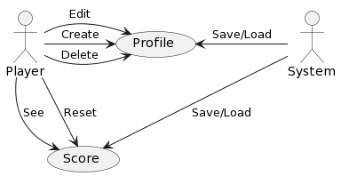
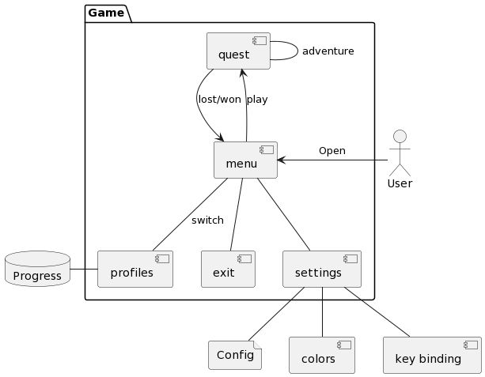
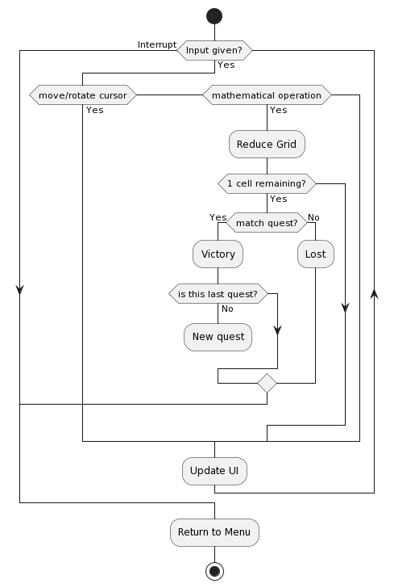
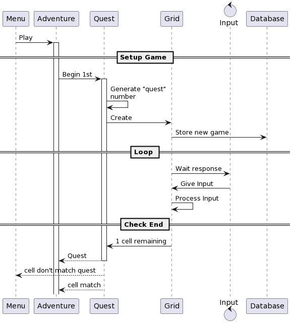

# Grid Quest

A minimal console game in which your goal is to reduce a grid of numbers up to a single specific result.

The game is meant to be played in spare times, when you are at your computer and want something fast and relaxing. It does not require expensive setup, neither does it requires much computer's power and memory, so it is perfect to run and play instantly.

Download the executable from this GitHub page and start playing!

## Gameplay

When you play a new game, you are given a grid of numbers and a ***quest***, that is a single number. Your goal is to reduce the grid until one number remains, and it must be the same as your quest.

To reduce the grid, move your cursor around the gird with the keyboard and select two cells. Then, perform an operation ($+$, $-$, $*$, …) by pressing the corresponding key on the keyboard.

But be careful! Every new challenge you start with only 10 life points and every operation has a cost:

- after reducing two cells, you lose an amount of hp equal to the difference between the two cells;
- luckily, each 2 operation performed you gain 5 hp.

## User Requirements

This section gathers some user requirements for the project.

### Functional Requirements

1. **Download the Application.** The application can be downloaded directly from the GitHub page. That page contains an executable file that is the playable game.

2. **Add profiles.** The system shall allow users to create 3 local profiles by providing distinct usernames. On the first login, the game asks the user's first profile username. There is no verification process since the profile does not contain important information.

3. **Change Profiles.** The system shall allow users to switch profile in any moment while in the menu.

4. **Delete Profiles.** The system shall allow users to delete their profiles in any moment, except when they have only one profile left. When a profile is deleted, so are their associated progress and suspended game.

5. **Change Settings.** The system shall allow users to edit input and visual settings in order to personalize the game experience. The settings configuration is unique for machine (i.e. global to a every profile, saved in the local host).

6. **Track Progress.** The system shall allow users to track their progress (i.e. the history of game won/lost, the high-score, and so on.). The progress is relative to a profile.

7. **Interrupt Game.** The system shall allow user to interrupt a game. When a game is interrupted, the user can decide to discard it and start a new one from the menu.

8. **Single Player.** The system shall run offline and with no multiplayer.

### Non-functional Requirements

1. The system shall not be strict in secure, since no important data are required and every progress is saved locally.

2. The system UI shall be high customizable and easy to change.

3. The system UI shall be easy to navigate and understand.

4. The game should be challenging.

5. The progress page should be exhaustive.

### Diagrams

Use-Case Diagrams

TODO Add another

## System Requirements

### Functional Requirements

1. **Operating System.** Windows 8 or higher.

2. The system aesthetics and controls shall change immediately whenever any settings is modified and saved.

3. The system shall updated the time spent while gaming every minute.

4. After a game is completed, the system shall update the user score with a new game and its result.

5. When a game is interrupted, the system shall save its state even for an immediate re-use.

6. While gaming, the system should track what user does after any input of interest.

### Non-Functional Requirements

1. The game shall run smooth without flickering. In other words, with high and constant performances.

2. The system shall be easy and fast to run since no expensive setup is required.

3. The system shall run in any windows system (8+) without requiring any change.

4. The game shall be run at any time and for any duration of time without any problem and system overloading.

5. The game should never have invalid settings. In case of wrong input or settings file, the system should run anyway with a default setting. Settings can't contrast each others.

### Diagrams

Architectural Diagram

Activity Diagrams

#### Quest

State Diagrams

#### Menu

.png "Architectural Diagram")

Message Sequence Charts

## Implementation

The project has been written in C++, using the `hiredis` library for the Redis connections.

## Software Structure

### Test Generator (Environment)

### System Under Design (SUD)

### Monitors

Monitors for the following requirements has been implemented (first 3 are non-functional, last 3 are functional):

1. The game should be challenging. (The monitor checks the users stats to determine whether the game is indeed hard for new-user, and fairly challenging for experienced users.)

2. The game shall run smooth. (The monitor checks the time required to complete the main operations and determines whether the system is updating too slow.)

3. The game shall run as long as desired. (The monitor checks whether the game closes unexpectedly and whether it requires more memory the more time it runs.)

4. Changes to settings shall be applied immediately.

5. Track user inputs.

6. Track user stats.
